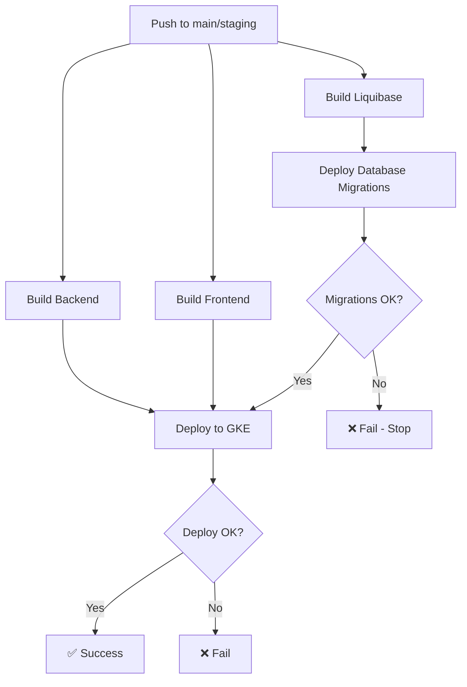

# GitHub Actions Workflows

## 📋 Przegląd

Projekt wykorzystuje GitHub Actions do automatycznego testowania i deploymentu na GCP.

## 🔄 Workflows

### 1. **test.yml** - Continuous Integration

Uruchamia się przy każdym push i pull request:
- Testy jednostkowe
- Testy integracyjne
- Code quality checks

### 2. **cd-gcp.yml** - Continuous Deployment to GCP

Automatyczny deployment do Google Kubernetes Engine (GKE).

#### Deployment Flow



#### Jobs

1. **build-and-push-backend** (parallel)
   - Buduje obraz Docker backendu
   - Push do Artifact Registry
   - Tags: `latest`, `{git-sha}`

2. **build-and-push-frontend** (parallel)
   - Buduje obraz Docker frontendu
   - Push do Artifact Registry
   - Tags: `latest`, `{git-sha}`

3. **build-and-push-liquibase** (parallel)
   - Buduje obraz Docker z migracjami Liquibase
   - Zawiera wszystkie changelogi z `db/changelog/`
   - Push do Artifact Registry
   - Tags: `latest`, `{git-sha}`

4. **deploy-database** (depends on: `build-and-push-liquibase`)
   - Usuwa poprzedni Kubernetes Job (jeśli istnieje)
   - Deploy `k8s/liquibase-job.yml`
   - Czeka na zakończenie migracji (timeout: 5 min)
   - Pobiera logi z wszystkich kontenerów:
     - Init container (Secret Manager)
     - Liquibase (migracje)
     - Cloud SQL Proxy
   - **BLOKUJE deployment aplikacji w przypadku błędu**

5. **deploy-to-gke** (depends on: `build-and-push-backend`, `build-and-push-frontend`, `deploy-database`)
   - Aktualizuje obrazy w deploymentach
   - Rolling update backendu
   - Rolling update frontendu
   - Weryfikacja statusu

6. **notify-deployment** (depends on: `deploy-database`, `deploy-to-gke`)
   - Wyświetla status całego deploymentu
   - Listuje wdrożone obrazy
   - Wyświetla odpowiedni komunikat:
     - ✅ Sukces pełnego deploymentu
     - ❌ Błąd migracji bazy danych
     - ❌ Błąd deploymentu aplikacji

## 🔒 Wymagane Sekrety

Konfiguracja w **Settings → Secrets and variables → Actions**:

| Secret | Opis | Przykład |
|--------|------|----------|
| `GCP_PROJECT_ID` | ID projektu GCP | `mkrew-478317` |
| `GCP_REGION` | Region GCP | `europe-central2` |
| `GKE_CLUSTER` | Nazwa klastra GKE | `mkrew-cluster` |
| `ARTIFACT_REGISTRY` | Nazwa repozytorium | `mkrew` |
| `GCP_WORKLOAD_IDENTITY_PROVIDER` | Provider Workload Identity | `projects/123.../providers/github` |
| `GCP_SERVICE_ACCOUNT` | Service Account email | `github-actions@...iam.gserviceaccount.com` |

## 🚀 Wyzwalacze

### Automatyczne

- **Push do `main`**: Deployment produkcyjny
- **Push do `staging`**: Deployment stagingowy

### Manualne

Workflow Dispatch z wyborem środowiska:
1. GitHub → Actions → "CD - Deploy to GCP"
2. Run workflow → Wybierz środowisko
3. Run

## 📊 Monitorowanie Deploymentu

### W GitHub Actions

1. Przejdź do **Actions** tab
2. Wybierz workflow run
3. Zobacz status każdego job:
   - 🟡 In Progress
   - ✅ Success
   - ❌ Failed

### Logi Migracji Bazy Danych

Job `deploy-database` automatycznie pobiera logi:

```bash
# Logi są wyświetlane w GitHub Actions w kroku:
# "Get migration logs"
```

Logi zawierają:
- **Init Container**: Pobieranie credentials z Secret Manager
- **Liquibase**: Wykonanie migracji
- **Cloud SQL Proxy**: Połączenie z bazą danych

### Ręczne Sprawdzenie

```bash
# Połącz się z GKE
gcloud container clusters get-credentials mkrew-cluster \
  --region=europe-central2 \
  --project=mkrew-478317

# Status migracji
kubectl get jobs liquibase-migration

# Logi migracji
kubectl logs -l app=mkrew-liquibase -c liquibase

# Status aplikacji
kubectl get pods -l app=mkrew-backend
kubectl get pods -l app=mkrew-frontend
```

## 🔄 Rollback

### Rollback Aplikacji

```bash
# Znajdź poprzednią wersję
kubectl rollout history deployment/mkrew-backend

# Rollback
kubectl rollout undo deployment/mkrew-backend
kubectl rollout undo deployment/mkrew-frontend
```

### Rollback Bazy Danych

⚠️ **UWAGA**: Rollback migracji wymaga manualnej interwencji!

Zobacz: `db/README-GCP.md` → Sekcja "Rollback"

## 🐛 Troubleshooting

### Problem: Migracje nie przeszły

1. Sprawdź logi w GitHub Actions (krok "Get migration logs")
2. Połącz się z GKE:
   ```bash
   kubectl logs -l app=mkrew-liquibase -c liquibase
   ```
3. Sprawdź status job:
   ```bash
   kubectl describe job liquibase-migration
   ```

### Problem: Deployment aplikacji nie przeszedł

```bash
# Sprawdź eventy
kubectl get events --sort-by='.lastTimestamp'

# Sprawdź status podów
kubectl describe pod <pod-name>

# Sprawdź logi
kubectl logs <pod-name>
```

### Problem: Timeout podczas migracji

Zwiększ timeout w `.github/workflows/cd-gcp.yml`:

```yaml
- name: Wait for migration to complete
  run: |
    kubectl wait --for=condition=complete --timeout=600s job/liquibase-migration
```

## 📚 Dodatkowe Zasoby

- [GitHub Actions Docs](https://docs.github.com/en/actions)
- [GCP Workload Identity](https://cloud.google.com/iam/docs/workload-identity-federation)
- [Kubernetes Jobs](https://kubernetes.io/docs/concepts/workloads/controllers/job/)
- [Liquibase Documentation](https://docs.liquibase.com/)

## ✅ Best Practices

1. **Testuj lokalnie** przed pushem do `main`
2. **Użyj staging** dla testów deploymentu
3. **Sprawdzaj logi** po każdym deploymencie
4. **Backup bazy** przed dużymi migracjami (manual w GCP Console)
5. **Monitoruj metryki** w GCP Cloud Monitoring

---

**Last updated**: 2025-11-16
